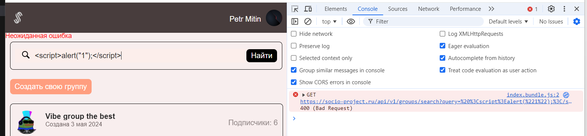
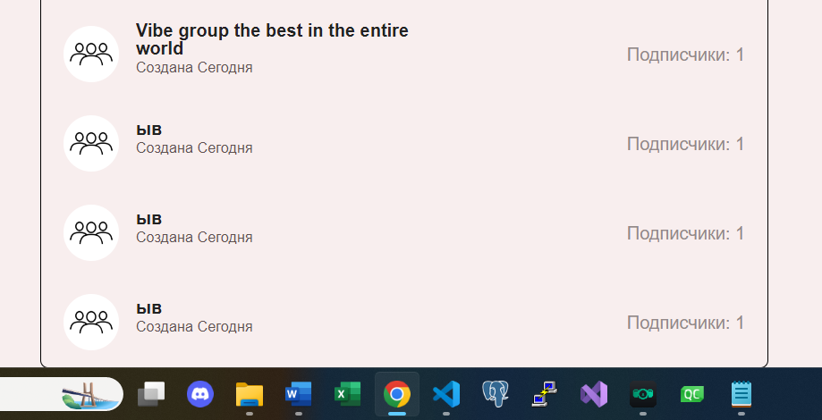

# ДЗ1 команды XRUST_BEZE 

<h3>Страница "Сообщества"</h3>
<ol>
    <li>
        Строка поиска
        <ul>
            <li>
                При поиске существующих групп по названию отображается плашки этих групп
            </li>
            <li>
                Если существует несколько групп с названием, начинающимся одинаково, то при поиске они все отображаются списком
            </li>
            <li>
                Если ищем несуществующую группу, то отображается "Нет результатов"
            </li>
            <li>
                Если очистить строку поиска, то отображается список групп, на которые я подписан
            </li>
            <li>
                Если очистить строку поиска, то отображается список групп, на которые я подписан. 
            </li>
            <li>
                <b>BUG: в случае из предыдущего пункта - вместе со списком моих групп отображается "Нет результатов"</b>
            </li>
            <li>
                Работает как кнопка "Найти", так и поиск по вводу (live search)
            </li>
            <li>
                <b>BUG: не по всей визуальной области инпута поиска можно кликнуть, чтобы вводить текст</b>
            </li>
            <li>
                При отсутствии введенного текста отображается плейсхолдер "Найти группу"
            </li>
            <li>
                <b>BUG: Можно вводить только пробелы в инпут, они убирают плейсхолдер, но поиска не происходит</b>
            </li>
            <li>
                <b>BUG: При вводе текста, который убирается санитайзером на сервере (фактически запрос - пустая строка), происходит необработанный 400 bad request, отображается "Неожиданная ошибка"</b>
                
            </li>
            <li>
                При изменении ширины/высоты экрана верстка результатов поиска не ломается
            </li>
        </ul>
    </li>
    <li>
        Список сообществ
        <ul>
            <li>
                В списке отображаются все сообщества, на которые я подписан, и только они
            </li>
            <li>
                При клике в область плашки сообщества происходит переход на его стену
            </li>
            <li>
                Корректно отображаются даты создания групп (Сегодня, Вчера, число+месяц+год)
            </li>
            <li>
                Корректно отображается количество подписчиков (в соответствии с реальностью, не на 1 больше/меньше)
            </li>
            <li>
                <b>BUG: если группы не помещаются на один экран, то нижний бордер списка прилеплен к низу окна (нет margin-bottom)</b>
                
            </li>
            <li>
                При отписке от группы она исчезает из списка
            </li>
            <li>
                При подписке на группу она появляется в списке
            </li>
            <li>
                При отсутствии подписок на группы отображается надпись "Вы не подписаны ни на какую группу"
            </li>
            <li>
                Если название не помещается в плашку, часть названия заменяется многоточием
            </li>
        </ul>
    </li>
    <li>
        Страница сообщества
        <ul>
            <li>
                Отображается название группы
            </li>
            <li>
                Отображается дата создания группы (Сегодня/Вчера/дата)
            </li>
            <li>
                Отображается описание группы (не более 100 символов, гарантированно помещается)
            </li>
            <li>
                Корректно отображается количество подписчиков (в соответствии с реальностью, не на 1 больше/меньше)
            </li>
            <li>
                Если название группы не помещается в виджет, то конец обрезается и заменяется многоточием
            </li>
            <li>
                При отписке/подписке соответственно изменяется количество ее подписчиков на +1/-1
            </li>
            <li>
                Не отображается иконка Настройки (шестеренка), если я не модератор
            </li>
            <li>
                Нельзя редактировать/удалять посты, если я не модератор
            </li>
            <li>
                <b>BUG: Если я удален из списка модераторов, я все еще могу редактировать/удалять посты, созданные мной</b>
            </li>
            <li>
                В url path отображается айдишник группы, на странице которой я нахожусь
            </li>
            <li>
                <b>BUG: Если заменить в урле айдишник группы на несуществующий, отрендерятся только навбар и хедер и выдаст надпись Неожиданная ошибка</b>
            </li>
            <li>
                Если заменить айдишник группы на другой существующий в урле и нажать Enter, приложение отрендерит страницу запрашиваемой группы 
            </li>
            <li>
                При изменении ширины и высоты окна верстка не ломается
            </li>
        </ul>
    </li>
</ol>
