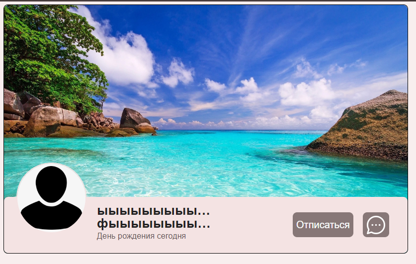
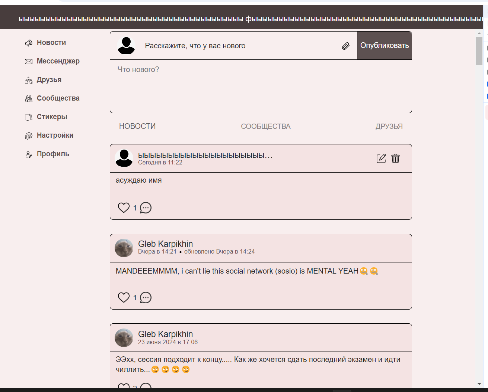
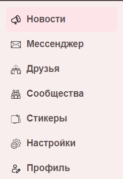

# ДЗ1 команды XRUST_BEZE 

<h3>Страница "Сообщества"</h3>
<ol>
    <li>
        Строка поиска
        <ul>
            <li>
                При поиске существующих групп по названию отображается плашки этих групп
            </li>
            <li>
                Если существует несколько групп с названием, начинающимся одинаково, то при поиске они все отображаются списком
            </li>
            <li>
                Если ищем несуществующую группу, то отображается "Нет результатов"
            </li>
            <li>
                Если очистить строку поиска, то отображается список групп, на которые я подписан
            </li>
            <li>
                <b>BUG: в случае из предыдущего пункта - вместе со списком моих групп отображается "Нет результатов"</b>
            </li>
        </ul>
    </li>
    <li>
        Список сообществ
        <ul>
            <li>
                В списке отображаются все сообщества, на которые я подписан, и только они
            </li>
            <li>
                При клике в область плашки сообщества происходит переход на его стену
            </li>
            <li>
                Корректно отображаются даты создания групп (Сегодня, Вчера, число+месяц+год)
            </li>
            <li>
                Корректно отображается количество подписчиков (в соответствии с реальностью, не на 1 больше/меньше)
            </li>
            <li>
                <b>BUG: если группы не помещаются на один экран, то нижний бордер списка прилеплен к низу окна (нет margin-bottom)</b>
                
            </li>
            <li>
                При отписке от группы она исчезает из списка
            </li>
            <li>
                При подписке на группу она появляется в списке
            </li>
            <li>
                При отсутствии подписок на группы отображается надпись "Вы не подписаны ни на какую группу"
            </li>
            <li>
                Если название не помещается в плашку, часть названия заменяется многоточием
            </li>
        </ul>
    </li>
    <li>
        Страница сообщества
        <ul>
            <li>
                Отображается название группы
            </li>
            <li>
                Отображается дата создания группы (Сегодня/Вчера/дата)
            </li>
            <li>
                Отображается описание группы (не более 100 символов, гарантированно помещается)
            </li>
            <li>
                Корректно отображается количество подписчиков (в соответствии с реальностью, не на 1 больше/меньше)
            </li>
            <li>
                Если название группы не помещается в виджет, то конец обрезается и заменяется многоточием
            </li>
            <li>
                При отписке/подписке соответственно изменяется количество ее подписчиков на +1/-1
            </li>
            <li>
                Не отображается иконка Настройки (шестеренка), если я не модератор
            </li>
            <li>
                Нельзя редактировать/удалять посты, если я не модератор
            </li>
            <li>
                В url path отображается айдишник группы, на странице которой я нахожусь
            </li>
            <li>
                <b>BUG: Если заменить в урле айдишник группы на несуществующий, отрендерятся только навбар и хедер и выдаст надпись Неожиданная ошибка</b>
            </li>
            <li>
                Если заменить айдишник группы на другой существующий в урле и нажать Enter, приложение отрендерит страницу запрашиваемой группы 
            </li>
        </ul>
    </li>
    </ol>
    <h3>Профиль пользователя</h3>
    <ol>
    <li>
        Общее
        <ul>
            <li>
                Отображается имя и фамилия пользователя
            </li>
            <li>
                Если имя и фамилия не вмещаются в виджет, они обрезаются, в конец помещается многоточие
            </li>
            <li>
                <b>BUG: если число дня рождения и текущее число совпадают (год и месяц - нет), то отображается  "День рождения сегодня" (аналогично с "вчера")</b>
            </li>
            <li>
                Если у профиля не установлен аватар, отображается дефолтный аватар
            </li>
            <li>
                У каждого профиля отображается обложка (фиксированная фотка для всех профилей)
                
            </li>
            <li>
                При нажатии на кнопку с иконкой "Сообщение" открывается диалог с пользователем, на странице которого мы находимся
            </li>
            <li>
                При нажатии кнопки "Отписаться" показывается попап с подтверждением отписки ("Вы уверены, что хотите удалить друга?")
            </li>
            <li>
                При нажатии кнопки "Отмена" в попапе из предыдущего пункта он пропадает, в остальном ничего не происходит
            </li>
            <li>
                При нажатии кнопки "Удалить" в попапе из предыдущего пункта он пропадает, у кнопки Отписаться меняется текст на Подписаться.
            </li>
            <li>
                При действиях из предыдущего пункта меняется цвет с темного на розовый у кнопки Отписаться и у кнопки с иконкой "Сообщение"
            </li>
            <li>
                При нажатии кнопки Подписаться текст кнопки меняется на Отписаться
            </li>
            <li>
                При действиях из предыдущего пункта меняется цвет с розового на темный у кнопки Подписаться и у кнопки с иконкой "Сообщение"
            </li>
            <li>
                Нельзя редактировать чужие посты на странице профиля
            </li>
            <li>
                При переходе на профиль отображается путь /profile/{id} в урле
            </li>
            <li>
                При смене id на существующий в урле и нажатии enter отрисовывается нужный профиль
            </li>
            <li>
                <b>
                    BUG: Если заменить в урле айдишник профиля на несуществующий, отрендерятся только навбар и хедер и выдаст надпись Неожиданная ошибка 
                </b>
            </li>
        </ul>
    </li>
    <li>
        Свой профиль
        <ul>
            <li>
                Отображается кнопка Настройки с иконкой шестеренки
            </li>
            <li>
                Нет кнопки Подписаться/Отписаться
            </li>
            <li>
                Вместо кнопки с иконкой "Сообщение" отрисовывается кнопка Избранное
            </li>
            <li>
                По нажатию кнопки Избранное происходит переход в диалог с собой
            </li>
            <li>
                Присутствует виджет создания постов
            </li>
            <li>
                Все посты, отображаемые на стене, можно редактировать и удалять
            </li>
        </ul>
    </li>
    </ol>
    <h3>Общие компоненты</h3>
    <ol>
    <li>
        Header
        <ul>
            <li>
                В хедере присутствуют логотип Socio, имя и фамилия пользователя и его аватарка                
            </li>
            <li>
                По клику на логотип происходит редирект на Ленту
            </li>
            <li>
                Если мы уже в Ленте, по клику на лого не происходит ничего
            </li>
            <li>
                По клику на область с именем, фамилией и аватаркой происходит переход в профиль залогиненного пользователя
            </li>
            <li>
                Если мы уже в своем профиле, то при действии из предыдущего пункта не происходит ничего
            </li>
            <li>
                Header is sticky. При скролле Ленты он остается виден вверху страницы.
            </li>
            <li>
                Хедер не ререндерится при переходе между страницами приложения
            </li>
            <li>
                <b>
                    BUG: При имени + фамилии, которые превосходят по длине хедер, они вытесняют аватарку, ее не видно в хедере 
                </b>
                
            </li>
        </ul>
    </li>
    <li>
        Navbar
        <ul>
            <li>
                Навбар рендерится на всех страницах приложения
                
            </li>
            <li>
                По клику на Новости происходит переход на Ленту, меняется урл на /feed/news
            </li>
            <li>
                По клику на Мессенджер происходит переход на список диалогов, меняется урл на /messenger
            </li>
            <li>
                По клику на Друзья происходит переход на список друзей, меняется урл на /community/friends
            </li>
            <li>
                По клику на Сообщества происходит переход на список моих сообществ, меняется урл на /groups
            </li>
            <li>
                По клику на Стикеры происходит переход на список всех стикеров, меняется урл на /stickers/all
            </li>
            <li>
                По клику на Настройки происходит переход на настройки профиля, меняется урл на /profile/settings
            </li>
            <li>
                По клику на Профиль происходит переход на профиль залогиненного юзера, меняется урл на /profile
            </li>
            <li>
                Элемент навбара, на котором находится курсор (::hover), подсвечивается чуть более ярким розовым
            </li>
            <li>
                В версии верстки под мобилки навбар переезжает в нижнюю часть страницы и становится sticky, названия страниц заменяются на соответствующие иконки
            </li>
        </ul>
    </li>
    <li>
        Компонент "Строка поиска"
        <ul>
            <li>
                Работает как кнопка "Найти", так и поиск по вводу (live search)
            </li>
            <li>
                <b>BUG: не по всей визуальной области инпута поиска можно кликнуть, чтобы вводить текст</b>
            </li>
            <li>
                При отсутствии введенного текста отображается плейсхолдер "Найти группу"
            </li>
            <li>
                <b>BUG: Можно вводить только пробелы в инпут, они убирают плейсхолдер, но поиска не происходит</b>
            </li>
            <li>
                <b>BUG: При вводе текста, который убирается санитайзером на сервере (фактически запрос - пустая строка), происходит необработанный 400 bad request, отображается "Неожиданная ошибка"</b>
                
            </li>
        </ul>
    </li>
</ol>
