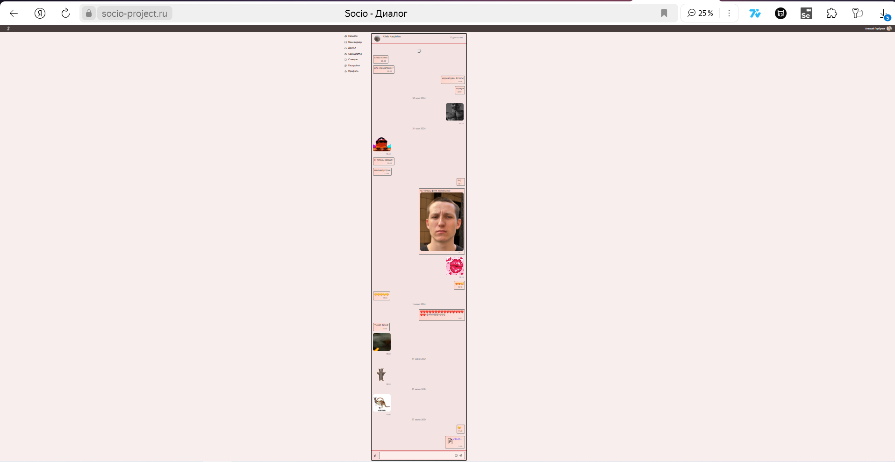
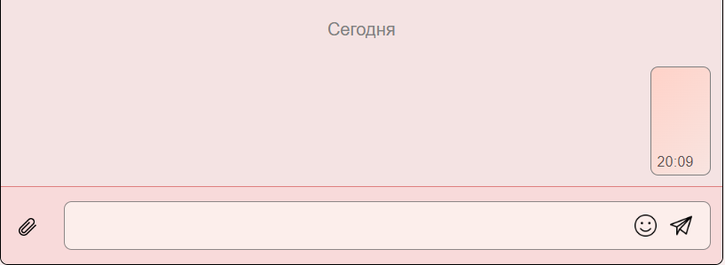
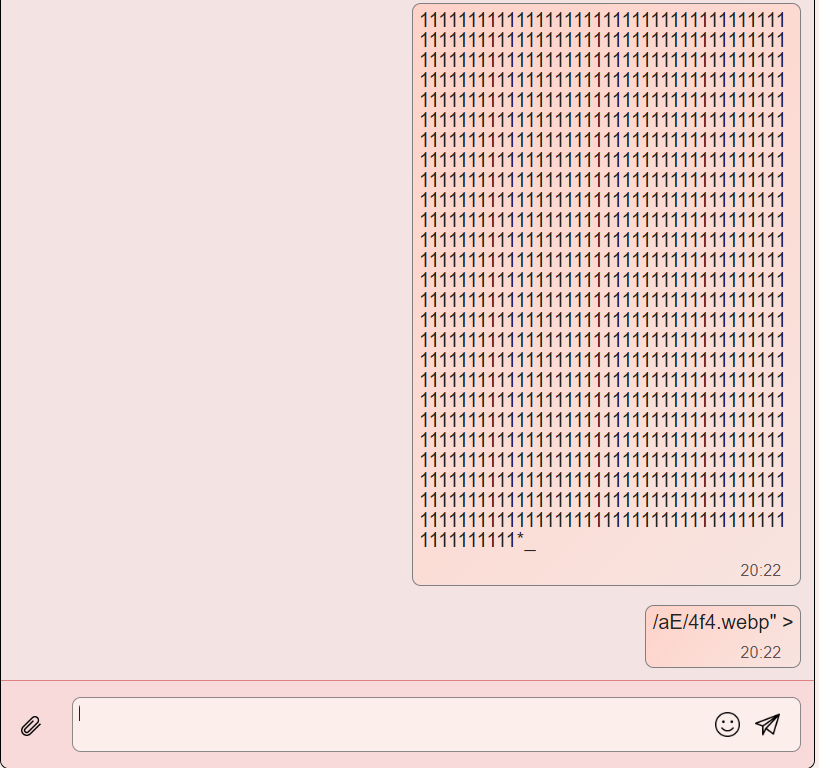
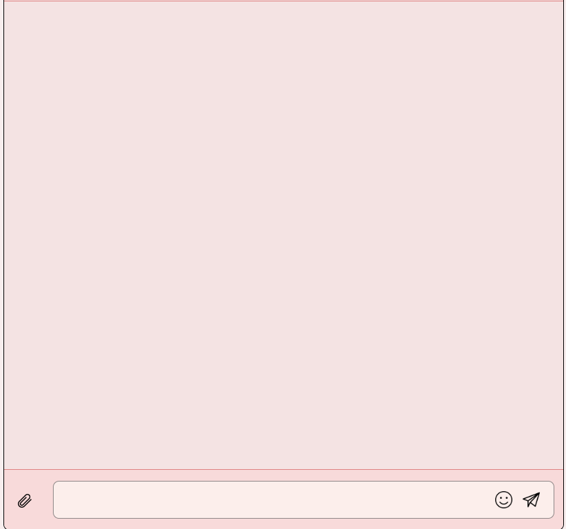
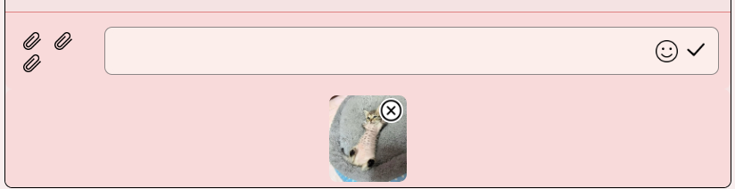
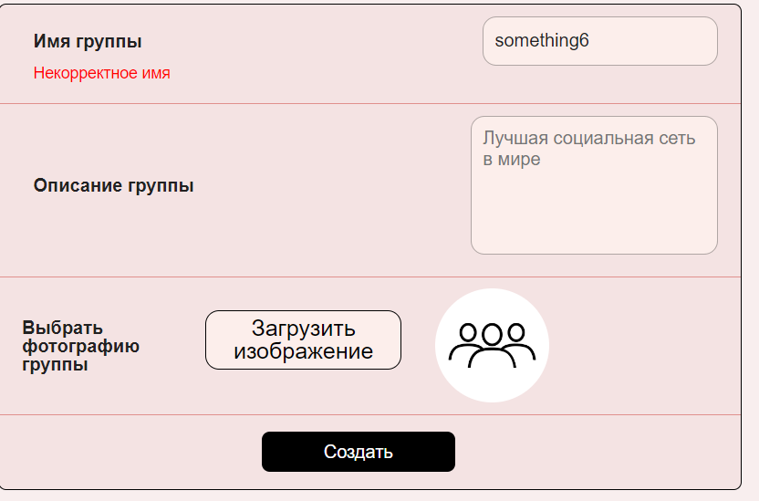
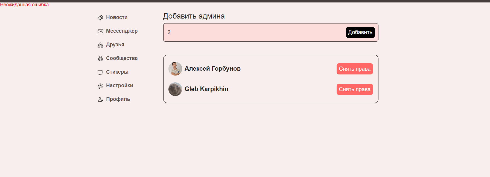

<h1>ДЗ1 команды XRUST_BEZE</h1>
<h3>Сообщения</h3>
<ol>
    <li>Просмотр диалога
        <ul>
            <li>при нажатии на диалог из списка диалогов происходит переход на страницу этого диалога</li>
            <li>при нажатии на кнопку «К диалогам» происходит переход на страницу со списком диалогов</li>
            <li><b>BUG: при вводе несуществующего ID пользователя в URL чата возникает "Неожиданная ошибка"</b></li>
            <li>при нажатии на кнопку “Escape” происходит переход на страницу со списком диалогов</li>
            <li>при нажатии на стрелку перехода назад в истории браузера происходит переходит на страницу со списком диалогов</li>
            <li>при нажатии на стрелку перехода вперед в истории браузера происходит переходит на страницу этого диалога</li>
            <li>при нажатии на аватарку собеседника происходит переход на страницу профиля собеседника</li>
            <li>при нажатии на стрелку перехода назад в истории браузера происходит переходит на страницу текущего диалога</li>
            <li>при отмотке в начало диалога сообщения загружаются и проставляется их дата</li>
            <li>при отмотке в конец диалога сообщения не удаляются и даты сохраняются</li>
            <li><b>BUG: при отмотке к началу диалога остаётся надпись «Начните диалог»</b></li>
            <li><b>BUG: при уменьшении масштаба страницы спиннер остаётся и не прогружаются новые сообщения (см. рисунок 1)</b>
            

                
                
<b>Рисунок 1</b> — Баг с не исчезновением спиннера

            

            </li>
            <li><b>BUG: если число месяца сообщения совпадает с сегодняшним числом в месяце, то будет надпись «Сегодня». Аналогично с «Вчера»</b></li>
            <li>при нажатии на файл в сообщении он скачивается</li>
        </ul>
    </li>
    <li>Написание сообщения
        <ul>
            <li>при отправлении первого сообщения в диалоге пропадает надпись «Начните диалог»</li>
            <li>при отправлении сообщения в качестве первого сообщения за день появляется надпись «Сегодня» в дате</li>
            <li>при отправлении сообщения оно появляется у обоих собеседников</li>
            <li>при отправлении сообщения оно появляется первым в списке диалогов на странице диалогов (https://socio-project.ru/messenger)</li>
            <li>отправление пустого сообщения не происходит</li>
            <li><b>BUG: происходит отправление сообщения, состоящего только из символов переноса строки и пробелов (см. рисунок 2)</b>
            

                
                
<b>Рисунок 2</b> — Баг с многострочным пустым сообщением

            

            </li>
            <li>при отправлении длинных сообщений текст переносится на следующую строку</li>
            <li>при вводе кода на JavaScript текст не исполняется как код</li>
            <li>при отправлении очень длинных сообщений (>1000 символов) сообщение разделяется на несколько</li>
            <li>при нажатии на смайлик появляется панель со смайликами</li>
            <li>при нажатии на значок смайлик панель со смайликами плавно убирается</li>
            <li><b>BUG: если смайлик лежит на границе разделения сообщений, то он разделяется пополам и превращается в неизвестный текст (см. рисунок 3)</b>
            

                
                
<b>Рисунок 3</b> — Разделение смайлика на сообщения

            

            </li>
            <li>при нажатии на значок стикера на панели смайликов появляется панель со стикерами</li>
            <li>при нажатии на значок смайлика на панели стикеров появляется панель со смайликами</li>
            <li>при нажатии на текст «МОИ» на панели всех стикеров появляется панель только с созданными мной стикерами</li>
            <li>при отсутствии созданных мной стикеров на панели стикеров появляется надпись «Стикеров нет. Вы можете создать их тут»</li>
            <li>при нажатии на слово «тут» происходит переход на страницу с созданием стикеров (https://socio-project.ru/stickers/all)</li>
            <li>при нажатии на стрелку перехода назад в истории браузера происходит переходит на страницу текущего диалога</li>
            <li>при нажатии на текст «ВСЕ» на панели моих стикеров появляется панель со всеми стикерами</li>
            <li>при нажатии на стикер на панели стикеров данный стикер отсылается как сообщение и пропадает панель стикеров</li>
            <li>при нажатии на значок скрепки открывается проводник</li>
            <li>при выборе картинки она добавляется как вложение под инпутом сообщения</li>
            <li>при выборе нескольких картинок они все добавляются как вложение под инпутом сообщения</li>
            <li>при добавлении вложений больше 5 — появляется предупреждение</li>
            <li>при нажатии крестик на добавленные вложения они удаляются </li>
            <li>при добавлении картинки и файла, не являющегося картинкой, они появляются как вложения под инпутом сообщения</li>
            <li>при добавлении файлов, суммарный размер которых превышает 20мб, вылезает ошибка</li>
            <li>при отправлении картинки она отображается в сообщении не как файл с именем, а как картинка</li>
            <li>при отправлении сообщения с файлами и текстом, длина которого больше 1000 символов, оно делится на несколько маленьких и все файлы прикрепляются к последнему сообщению</li>
        </ul>
    </li>
    <li>Удаление сообщения
        <ul>
            <li>при нажатии на значок мусорного бака у сообщения появляется модальное окно с подтверждением удаления сообщения</li>
            <li>при появлении модального окна нажатие на любой другом месте страницы кроме окна не считывается</li>
            <li>при нажатии на кнопку «Отмена» модальное окно исчезает</li>
            <li>при нажатии на кнопку «Удалить» сообщение удаляется у обоих собеседников</li>
            <li>при удалении всех сообщений за определенную дату эта дата исчезает</li>
            <li><b>BUG: при удалении всех сообщений в диалоге не появляется надпись «Начните диалог» (см. рисунок 4)</b>
            

                
                
<b>Рисунок 4</b> — Пустой диалог

            

            </li>
            <li>при удалении сообщения с файлами файлы корректно удаляются</li>
            <li>при удалении всех сообщений диалога он пропадает из списка диалогов на странице диалогов (https://socio-project.ru/messenger)</li>
        </ul>
    </li>
    <li>Изменение сообщения
        <ul>
            <li>при нажатии на значок карандаша около сообщения его содержимое появляется в инпуте (файлы под инпутом)</li>
            <li>при нажатии на галочку оригинальное сообщение меняется</li>
            <li><b>BUG: не изменяя сообщение и принимая изменение, внизу оригинального сообщения появляется текст «ред.»</b></li>
            <li>при изменении сообщения в его низу появляется текст «ред.»</li>
            <li>при изменении сообщения оно изменяется у обоих собеседников</li>
            <li><b>BUG: при повторном нажатии дублируется значок скрепки слева от инпута (см. рисунок 5)</b>
            

                
                
<b>Рисунок 5</b> — Дублирование значка скрепки

            

            </li>
            <li>при изменении текста в пустое сообщение при его изменении текст в оригинальном сообщении обновляется</li>
            <li>при нажатии на крестик файл удаляется из вложений</li>
            <li>при изменении файлов сообщения файлы обновляются в оригинальном сообщении</li>
            <li>при попытке вложить файлы, суммарный размер которых больше 20 мб или количество которых больше 5, появляется предупреждение</li>
            <li>при добавлении смайликов в сообщение оригинальное сообщение дополняется смайликами</li>
            <li>при удалении всего содержимого изменяемого сообщения оригинальное сообщение удаляется</li>
        </ul>
    </li>
</ol>

<h3>Сообщества</h3>
<ol>
    <li>Создание сообщества
        <ul>
            <li>при вводе пустого имени группы возникает ошибка</li>
            <li><b>BUG: </b>при вводе имени группы с цифрами возникает ошибка (см. рисунок 6)</b>
            

                
                
<b>Рисунок 6</b> — Ошибка при вводе цифр в инпут имени группы

            

            </li>
            <li>при вводе имени группы с пробелами ошибки нет</li>
            <li>при вводе имени группы со специальными символами: !@#$%^&*()+_=~`"№;%:?<>/\|{}[] – возникает ошибка</li>
            <li>при вводе имени группы, состоящего только из пробелов, возникает ошибка</li>
            <li>при вводе пустого описания группы возникает ошибка</li>
            <li>при вводе описания группы, состоящего только из переносов строки или пробелов, возникает ошибка</li>
            <li>при нажатии на кнопку «Загрузить» открывается проводник</li>
            <li>при выборе картинки картинка появляется справа в круге от кнопки «Загрузить»</li>
            <li>при попытке загрузить не картинку возникает ошибка и картинка не загружается</li>
            <li>при пустых полях имени группы или описания группы при нажатии на кнопку «Создать» возникает соответствующая ошибка</li>
            <li>при нажатии на кнопку «Создать» при отсутствии ошибок происходит переход нас траницу созданной группы</li>
            <li>при отсутствии выбора фотографии группы и нажатии на кнопку «Создать» осуществляется переход на страницу созданной группы и установление аватарки группы по умолчанию</li>
        </ul>
    </li>
    <li>Удаление сообщества
        <ul>
            <li>при нажатии на кнопку «Удалить группу» появляется модальное окно с выбором</li>
            <li>при нажатии на кнопку «Отменить» модальное окно исчезает</li>
            <li>при нажатии на кнопку «Удалить» группа удаляется и происходит переход на страницу со списком моих групп</li>
        </ul>
    </li>
    <li>Изменение сообщества
        <ul>
            <li>при нажатии на значок шестерёнки в правом верхнем углу фона группы происходит переход на страницу с настройками группы</li>
            <li>при нажатии на кнопку «Вернуться к группе» происходит переход на страницу группы</li>
            <li>при нажатии на стрелку перехода назад в истории браузера происходит переходит на страницу группы</li>
            <li>при изменении некоторых полей группы и нажатии на кнопку «Вернуться к группе» настройки группы не меняются и происходит переход на страницу группы</li>
            <li>при вводе пустого имени группы возникает ошибка</li>
            <li>при вводе имени группы с цифрами возникает ошибка </li>
            <li>при вводе имени группы с пробелами ошибки нет</li>
            <li>при вводе имени группы со специальными символами: !@#$%^&*()+_=~`"№;%:?<>/\|{}[] - возникает ошибка</li>
            <li>при вводе имени группы, состоящего только из пробелов, возникает ошибка</li>
            <li>при вводе пустого описания группы возникает ошибка</li>
            <li>при вводе описания группы, состоящего только из переносов строки или пробелов, возникает ошибка</li>
            <li>при нажатии на кнопку «Загрузить» открывается проводник</li>
            <li>при выборе картинки картинка появляется справа в круге от кнопки «Загрузить»</li>
            <li>при попытке загрузить не картинку возникает ошибка и картинка не загружается</li>
            <li>при нажатии на кнопку «Отменить изменения» все поля группы принимают свои первоначальные значения</li>
            <li>при нажатии на кнопку «Сохранить» при отсутствии ошибок происходит обновление настроек группы и переход на страницу группы</li>
            <li>при пустых полях имени группы или описания группы при нажатии на кнопку «Сохранить» возникает соответствующая ошибка</li>
        </ul>
    </li>
</ol>

<h3>Модерация сообщества</h3>
<ol>
    <li>Просмотр модераторов сообщества
        <ul>
            <li>при нажатии кнопки «Модераторы группы» на странице группы, администратором которой вы являетесь, происходит переход на страницу со списком модераторов данной группы</li>
        </ul>
    </li>
    <li>Создание модераторов
        <ul>
            <li>при вводе ID пользователя и нажатии на кнопку «Добавить» добавляется строка с новым модератором</li>
            <li>при пустом инпуте и нажатии на кнопку «Добавить» возникает ошибка</li>
            <li>при нечисловом значении ID пользователя в инпуте и нажатии на кнопку «Добавить» возникает ошибка</li>
            <li>при несуществующем ID пользователя в инпуте и нажатии на кнопку «Добавить» возникает ошибка</li>
            <li><b>BUG: при вводе ID уже существующего модератора возникает ошибка (см. рисунок 7)</b>
            

                
                
<b>Рисунок 7</b> — Ошибка при добавлении существующего модератора

            

            </li>
        </ul>
    </li>
    <li>Удаление модератора
        <ul>
            <li>при нажатии на кнопку «Снять права» конкретного модератора он перестаёт быть администратором группы и пропадает из списка</li>
        </ul>
    </li>
</ol>
